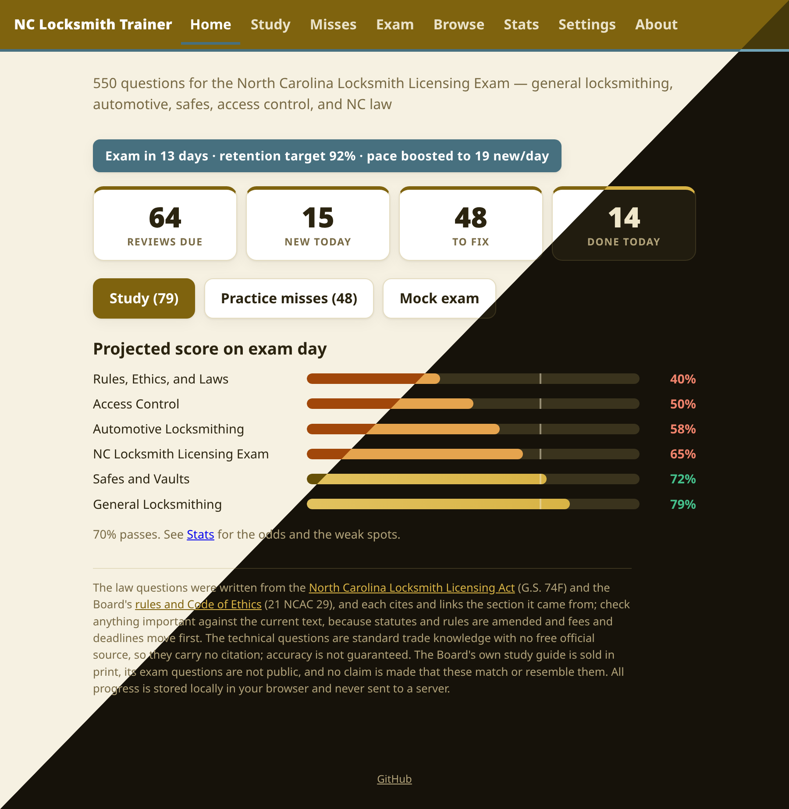
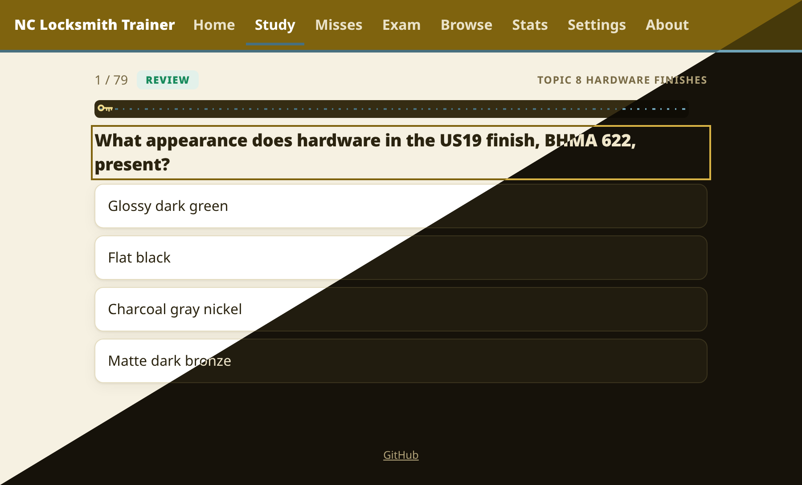
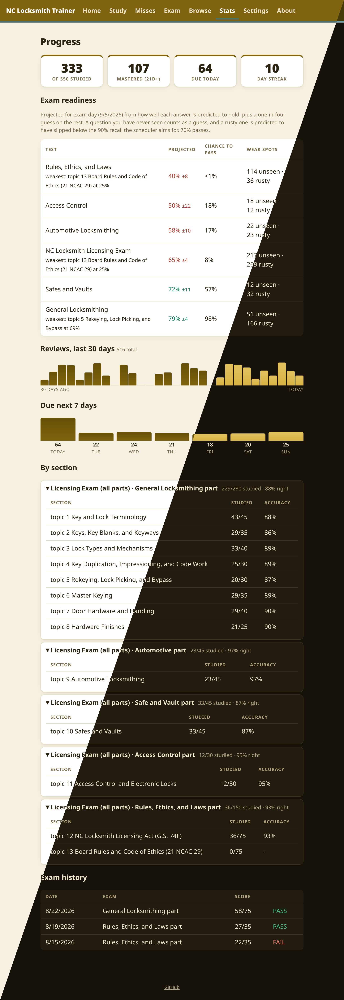

# Screenshots

Each image is split diagonally to show the light and dark themes, which follow the
browser's color scheme preference.

They are generated, not captured by hand. `generate.sh` feeds the app a seeded demo
profile (`seed.js`: a Universal attempt twelve days out, with Type III and the MVAC
material lagging behind), shoots each view once per theme in headless Chrome, and
composites the two across the diagonal. It needs Chrome or Chromium and ImageMagick:

```
./docs/screenshots/generate.sh home study stats
```

## Home

Due reviews, new cards for the day, the misses pool, an exam countdown banner when a
test date is set, and the projected score for each certification being studied for.



## Study

A spaced repetition session. The progress bar is styled as a pressure-gauge scale
with a recovery cylinder riding the fill, and the header shows the exam topic the
question came from.



## Stats

Mastery tiles, the exam readiness projection with the odds of passing, a 7-day due
forecast, per-topic progress and accuracy, and exam history.


